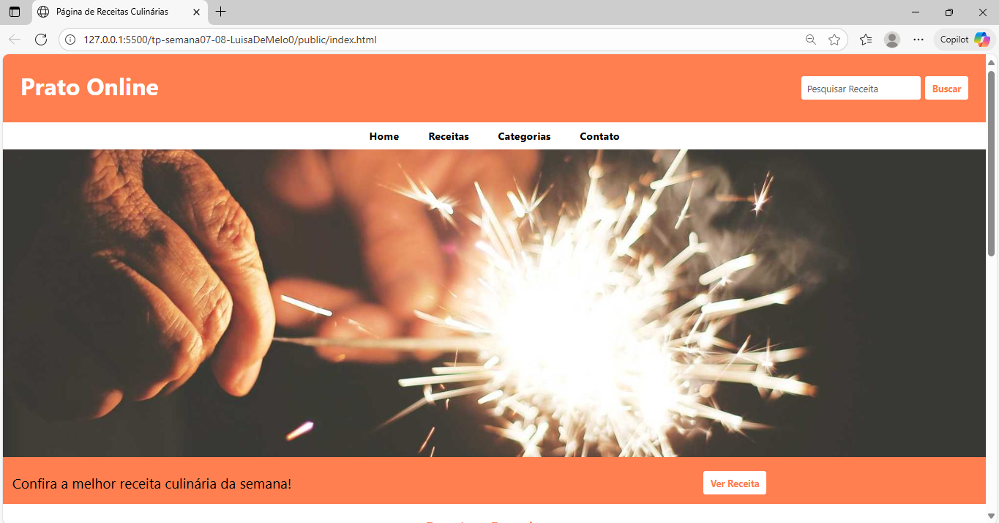
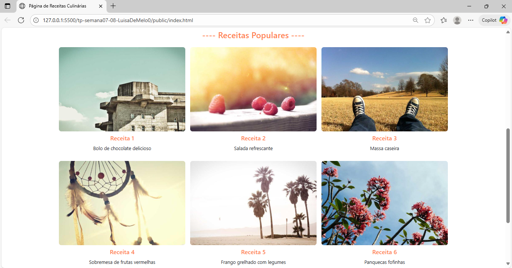
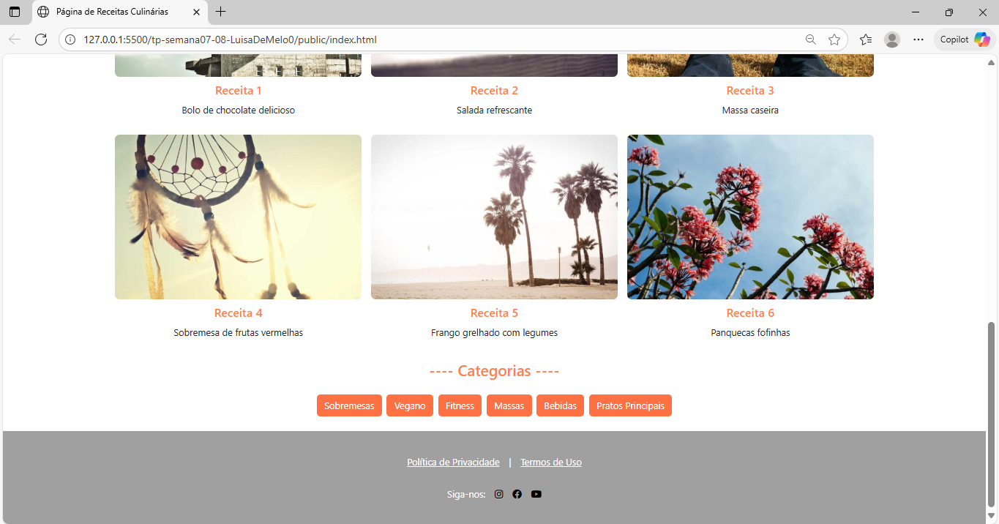
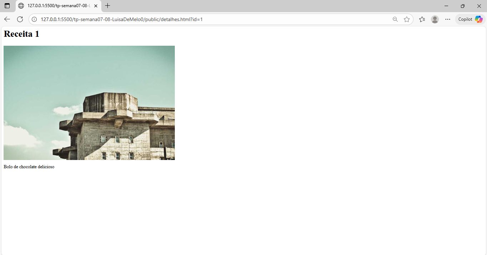

[](https://classroom.github.com/a/KZhXwLZL)
[](https://classroom.github.com/open-in-codespaces?assignment_repo_id=20650638)
# Trabalho Prático 05 - Semanas 7 e 8

**Páginas de detalhes dinâmicas**

Nessa etapa, vamos evoluir o trabalho anterior, acrescentando a página de detalhes, conforme o  projeto escolhido. Imagine que a página principal (home-page) mostre um visão dos vários itens que existem no seu site. Ao clicar em um item, você é direcionado pra a página de detalhes. A página de detalhe vai mostrar todas as informações sobre o item do seu projeto. seja esse item uma notícia, filme, receita, lugar turístico ou evento.

Leia o enunciado completo no Canvas. 

**IMPORTANTE:** Assim como informado anteriormente, capriche na etapa pois você vai precisar dessa parte para as próximas semanas. 

**IMPORTANTE:** Você deve trabalhar e alterar apenas arquivos dentro da pasta **`public`,** mantendo os arquivos **`index.html`**, **`styles.css`** e **`app.js`** com estes nomes, conforme enunciado. Deixe todos os demais arquivos e pastas desse repositório inalterados. **PRESTE MUITA ATENÇÃO NISSO.**

## Informações Gerais

- Nome: Luísa de Melo
- Matricula: 1629202
- Proposta de projeto escolhida: Página de receitas culinárias
- Breve descrição sobre seu projeto: Meu projeto é uma página de receitas culinárias dos mais diversos tipos.

## Print da Home-Page





## Print da página de detalhes do item



## Cole aqui abaixo a estrutura JSON utilizada no app.js

```javascript
const receitas = [
  { id: 1, titulo: "Receita 1", descricao: "Bolo de chocolate delicioso", imagem: "https://picsum.photos/id/101/600/400" },
  { id: 2, titulo: "Receita 2", descricao: "Salada refrescante", imagem: "https://picsum.photos/id/102/600/400" },
  { id: 3, titulo: "Receita 3", descricao: "Massa caseira", imagem: "https://picsum.photos/id/103/600/400" },
  { id: 4, titulo: "Receita 4", descricao: "Sobremesa de frutas vermelhas", imagem: "https://picsum.photos/id/104/600/400" },
  { id: 5, titulo: "Receita 5", descricao: "Frango grelhado com legumes", imagem: "https://picsum.photos/id/108/600/400" },
  { id: 6, titulo: "Receita 6", descricao: "Panquecas fofinhas", imagem: "https://picsum.photos/id/106/600/400"},
];
```
